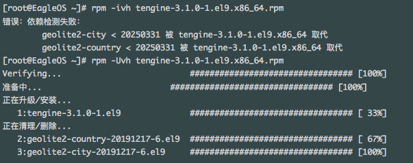

## Tengine RPM

Unofficial Tengine RPM packaging for quick installation.

Tengine is a distribution of Nginx with some advanced features.

This is a rpm package based on the official package https://tengine.taobao.org/download/tengine-3.1.0.tar.gz, which is easy to install and use, you can download it for free.

Only the almalinux 9.5-based rpm package is available first, which can also be used for Red Hat Enterprise Linux (RHEL) and its derivatives, such as CentOS Linux and Rocky Linux.

## How to download?

Click on the tengine-3.1.0-1.el9.x86_64.rpm link under Releases on the right to download it directly, or download it from the following URL:

https://tengine-rpm.sourceforge.io

## How to install?

rpm -Uvh tengine-3.1.0-1.el9.x86_64.rpm

As shown in the image below:

## changelog

* Mon Mar 31 2025 Eagle <www@xmyy.com> - 3.1.0-1
- Built for AlmaLinux 9.5, initial build with LuaJIT,ModSecurity,geoip2,etc. supports

## 中文说明

非官方 Tengine RPM 压缩包，用于快速安装。

Tengine是一个具有一些高级功能的 Nginx 发行版。

这是基于官方包https://tengine.taobao.org/download/tengine-3.1.0.tar.gz 制作的rpm包，方便快速安装使用，您可免费下载使用。

目前仅先推出基于almalinux 9.5的rpm包，同样可用于Red Hat Enterprise Linux (RHEL) 及其衍生产品，如CentOS Linux、Rocky Linux。

## 如何下载？

点击右边Releases下面的tengine-3.1.0-1.el9.x86_64.rpm链接直接下载，或者从下面网址下载：

https://tengine-rpm.sourceforge.io

## 如何安装？

rpm -Uvh tengine-3.1.0-1.el9.x86_64.rpm

如下图所示：

## 更新日志

* Mon Mar 31 2025 Eagle <www@xmyy.com> - 3.1.0-1
- 为 AlmaLinux 9.5 构建，初始构建包含 LuaJIT、ModSecurity、geoip2 等支持。
