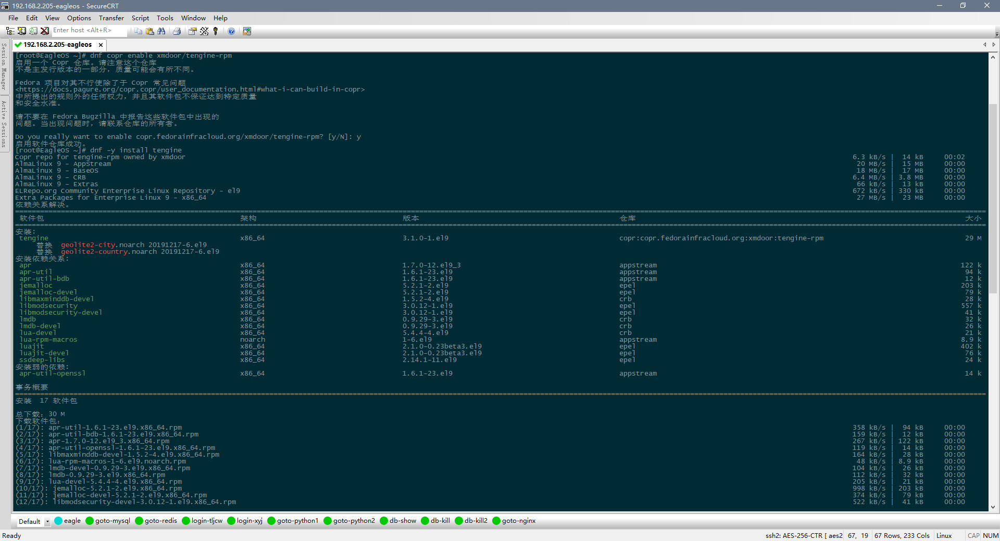

## **Tengine RPM** [中文](README_CN.md)

Tengine is a high-performance HTTP and reverse proxy web server originated by Taobao, the largest e-commerce website in Asia. It is based on the Nginx HTTP server and has many advanced features. Tengine has proven to be very stable and efficient on some of the top 100 websites in the world, including Taobao.com, Tmall.com, Youku, AliExpress and Alibaba Cloud.

In short, Tengine is a distribution of Nginx with some advanced features.Tengine does not provide official RPM packages, here to provide unofficial optimized compilation and integration of LuaJIT, ModSecurity, geoip2, and other commonly used modules of the Tengine RPM packages, to facilitate the user to quickly install and configure the web server on the target server.

This is a rpm package based on the official package https://tengine.taobao.org/download/tengine-3.1.0.tar.gz, which is easy to install and use, you can download and install it for free.

Only the almalinux 9.5-based rpm package is available first, which can also be used for Red Hat Enterprise Linux (RHEL) and its derivatives, such as CentOS Linux and Rocky Linux.

## **How to download?**

https://github.com/eagleos/tengine-rpm/releases

https://tengine-rpm.sourceforge.io

## **How to install?**

- **manual installation**

rpm -Uvh tengine-3.1.0-1.el9.x86_64.rpm

As shown below:
```shell
[root@EagleOS ~]# rpm -ivh tengine-3.1.0-1.el9.x86_64.rpm
Error: dependency detection failed:
geolite2-city < 20250331 is replaced by tengine-3.1.0-1.el9.x86_64
geolite2-country < 20250331 is replaced by tengine-3.1.0-1.el9.x86_64
[root@EagleOS ~]# rpm -Uvh tengine-3.1.0-1.el9.x86_64.rpm
Verifying...                          ################################# [100%]
Preparing...                          ################################# [100%]
Upgrading/installing...
1:tengine-3.1.0-1.el9              ################################# [ 33%]
Cleaning/deleting...
2:geolite2-country-20191217-6.el9  ################################# [ 67%]
3:geolite2-city-20191217-6.el9     ################################# [100%]
```

As shown in the image below:


- **Online Installation**

```shell
dnf copr enable xmdoor/tengine-rpm
dnf -y install tengine
```
As shown in the image below:



## **Requirements**

If you are prompted with a message similar to the following during installation:
```shell
[root@EagleOS ~]# rpm -ivh tengine-3.1.0-1.el9.x86_64.rpm 
Error: dependency detection failed:
        apr >= 1.7.0 is required by tengine-3.1.0-1.el9.x86_64
        apr-util >= 1.6.1 is required by tengine-3.1.0-1.el9.x86_64
        jemalloc >= 5.2.1 is required by tengine-3.1.0-1.el9.x86_64
        jemalloc-devel >= 5.2.1 is required by tengine-3.1.0-1.el9.x86_64
        libluajit-5.1.so.2()(64bit) is required by tengine-3.1.0-1.el9.x86_64
        libmaxminddb-devel >= 1.5.2 is required by tengine-3.1.0-1.el9.x86_64
        libmodsecurity >= 3.0.12 is required by tengine-3.1.0-1.el9.x86_64
        libmodsecurity-devel >= 3.0.12 is required by tengine-3.1.0-1.el9.x86_64
        libmodsecurity.so.3()(64bit) is required by tengine-3.1.0-1.el9.x86_64
        lmdb >= 0.9.29 is required by tengine-3.1.0-1.el9.x86_64
        lmdb-devel >= 0.9.29 is required by tengine-3.1.0-1.el9.x86_64
        lua-devel >= 5.4.4 is required by tengine-3.1.0-1.el9.x86_64
        luajit >= 2.1.0 is required by tengine-3.1.0-1.el9.x86_64
        luajit-devel >= 2.1.0 is required by tengine-3.1.0-1.el9.x86_64
        geolite2-city < 20250331 is replaced by tengine-3.1.0-1.el9.x86_64
        geolite2-country < 20250331 is replaced by tengine-3.1.0-1.el9.x86_64
```
Please download the relevant dependency packages first:
```shell
wget https://repo.almalinux.org/almalinux/9/AppStream/x86_64/os/Packages/apr-1.7.0-12.el9_3.x86_64.rpm
wget https://repo.almalinux.org/almalinux/9/AppStream/x86_64/os/Packages/apr-util-1.6.1-23.el9.x86_64.rpm
wget https://repo.almalinux.org/almalinux/9/AppStream/x86_64/os/Packages/apr-util-bdb-1.6.1-23.el9.x86_64.rpm
wget https://repo.almalinux.org/almalinux/9/CRB/x86_64/os/Packages/libmaxminddb-devel-1.5.2-4.el9.x86_64.rpm
wget https://repo.almalinux.org/almalinux/9/CRB/x86_64/os/Packages/lmdb-0.9.29-3.el9.x86_64.rpm
wget https://repo.almalinux.org/almalinux/9/CRB/x86_64/os/Packages/lmdb-devel-0.9.29-3.el9.x86_64.rpm
wget https://repo.almalinux.org/almalinux/9/CRB/x86_64/os/Packages/lua-devel-5.4.4-4.el9.x86_64.rpm
wget https://repo.almalinux.org/almalinux/9/AppStream/x86_64/os/Packages/lua-rpm-macros-1-6.el9.noarch.rpm
wget https://repo.almalinux.org/almalinux/9/devel/x86_64/os/Packages/lua-static-5.4.4-4.el9.x86_64.rpm
wget https://repo.almalinux.org/almalinux/9/devel/x86_64/os/Packages/pcre2-static-10.40-6.el9.x86_64.rpm
wget https://dl.fedoraproject.org/pub/epel/9/Everything/x86_64/Packages/l/libmodsecurity-3.0.12-1.el9.x86_64.rpm
wget https://dl.fedoraproject.org/pub/epel/9/Everything/x86_64/Packages/l/libmodsecurity-devel-3.0.12-1.el9.x86_64.rpm
wget https://dl.fedoraproject.org/pub/epel/9/Everything/x86_64/Packages/l/libmodsecurity-static-3.0.12-1.el9.x86_64.rpm
wget https://dl.fedoraproject.org/pub/epel/9/Everything/x86_64/Packages/s/ssdeep-libs-2.14.1-11.el9.x86_64.rpm
wget https://dl.fedoraproject.org/pub/epel/9/Everything/x86_64/Packages/j/jemalloc-5.2.1-2.el9.x86_64.rpm
wget https://dl.fedoraproject.org/pub/epel/9/Everything/x86_64/Packages/j/jemalloc-devel-5.2.1-2.el9.x86_64.rpm
wget https://dl.fedoraproject.org/pub/epel/9/Everything/x86_64/Packages/l/luajit-2.1.0-0.23beta3.el9.x86_64.rpm
wget https://dl.fedoraproject.org/pub/epel/9/Everything/x86_64/Packages/l/luajit-devel-2.1.0-0.23beta3.el9.x86_64.rpm
```
Then install it:
```shell
rpm -ivh apr-util-bdb-1.6.1-23.el9.x86_64.rpm apr-1.7.0-12.el9_3.x86_64.rpm apr-util-1.6.1-23.el9.x86_64.rpm
rpm -ivh libmaxminddb-devel-1.5.2-4.el9.x86_64.rpm
rpm -ivh lmdb-0.9.29-3.el9.x86_64.rpm lmdb-devel-0.9.29-3.el9.x86_64.rpm
rpm -ivh lua-rpm-macros-1-6.el9.noarch.rpm lua-devel-5.4.4-4.el9.x86_64.rpm lua-static-5.4.4-4.el9.x86_64.rpm
rpm -ivh pcre2-static-10.40-6.el9.x86_64.rpm
rpm -ivh ssdeep-libs-2.14.1-11.el9.x86_64.rpm libmodsecurity-3.0.12-1.el9.x86_64.rpm libmodsecurity-devel-3.0.12-1.el9.x86_64.rpm libmodsecurity-static-3.0.12-1.el9.x86_64.rpm
rpm -ivh jemalloc-5.2.1-2.el9.x86_64.rpm jemalloc-devel-5.2.1-2.el9.x86_64.rpm
rpm -ivh luajit-2.1.0-0.23beta3.el9.x86_64.rpm luajit-devel-2.1.0-0.23beta3.el9.x86_64.rpm
```

## **Distro support**

The following distribution was tested and passed:

Almalinux 9.5 x86_64

Compatible with the following releases, untested:

Red Hat Enterprise Linux 9.x x86_64

CentOS Linux 9.x x86_64

Rocky Linux 9.x x86_64

## **Configuration**

- The nginx configuration file is located at: /app/nginx/conf
- After installation will automatically start nginx service, manual restart service command: systemctl restart nginx, reload configuration command: systemctl reload nginx
- In the process of installing the rpm package, the number of cpu cores of the target server will be automatically detected, and the nginx configuration will be automatically optimized for the configuration process
- For the target server default site, access to the offshore server is disabled by default in nginx.conf to save server-related access resources. If you need to open this access, you can change this file by removing the following configuration statement:
```shell
  if ($ip_deny) {
  return 503;
  }
```
- Support for lua syntax, the relevant test statements, please see the configuration of nginx.conf, you can modify the relevant configuration for the test
- vhost.conf is an example of a site configuration that is not loaded by default, but can be modified and started by imitating it.
- The modsecurity anti-attack module, i.e. Web Application Firewall (WAF), is enabled by default in vhost.conf, the configuration file is located at: `/app/nginx/conf/modsecurity`, and the logs are located at: `/app/nginx/logs/modsec_audit.log`
- The compilation parameters for this rpm package are as follows:
```shell
[root@EagleOS ~]# nginx -V
Tengine version: Microsoft-IIS/3.1.0
nginx version: Microsoft-IIS/8.5/1.24.0
built by gcc 11.5.0 20240719 (Red Hat 11.5.0-5) (GCC)
built with OpenSSL 3.2.2 4 Jun 2024
TLS SNI support enabled
configure arguments: --prefix=/app/nginx --sbin-path=/usr/sbin/nginx --with-http_ssl_module --with-ld-opt=-lpcre --with-http_stub_status_module --with-http_gzip_static_module --with-http_realip_module --with-ld-opt=-ljemalloc --with-jemalloc --with-stream --with-stream_ssl_module --with-stream_realip_module --with-stream_ssl_preread_module --with-debug --with-compat --with-file-aio --with-mail --with-mail_ssl_module --with-pcre --with-pcre-jit --with-threads --with-http_auth_request_module --with-http_dav_module --with-http_degradation_module --with-http_flv_module --with-http_gunzip_module --with-http_image_filter_module --with-http_mp4_module --with-http_random_index_module --with-http_secure_link_module --with-http_sub_module --with-http_v2_module --with-http_addition_module --with-luajit-inc=/usr/include/luajit-2.1 --with-luajit-lib=/usr/lib64 --without-http_upstream_keepalive_module --add-module=modules/ngx_backtrace_module --add-module=modules/ngx_debug_pool --add-module=modules/ngx_debug_timer --add-module=modules/ngx_http_concat_module --add-module=modules/ngx_http_footer_filter_module --add-module=modules/ngx_http_reqstat_module --add-module=modules/ngx_http_slice_module --add-module=modules/ngx_http_trim_filter_module --add-module=modules/ngx_http_upstream_check_module --add-module=modules/ngx_http_upstream_dynamic_module --add-module=modules/ngx_http_upstream_dyups_module --add-module=modules/ngx_http_upstream_keepalive_module --add-module=modules/ngx_http_upstream_session_sticky_module --add-module=modules/ngx_http_upstream_vnswrr_module --add-module=modules/ngx_http_user_agent_module --add-module=modules/ngx_multi_upstream_module --add-module=modules/ngx_slab_stat --add-module=../ngx_cache_purge-2.5.3 --add-module=../ngx_brotli --add-module=../nginx-module-vts-0.2.4 --add-module=../ngx_http_geoip2_module --add-module=../lua-nginx-module-0.10.28 --add-module=../ModSecurity-nginx-master --with-cc-opt='-O2 -flto=auto -ffat-lto-objects -fexceptions -g -grecord-gcc-switches -pipe -Wall -Werror=format-security -Wp,-D_FORTIFY_SOURCE=2 -Wp,-D_GLIBCXX_ASSERTIONS -specs=/usr/lib/rpm/redhat/redhat-hardened-cc1 -fstack-protector-strong -specs=/usr/lib/rpm/redhat/redhat-annobin-cc1 -m64 -march=x86-64-v2 -mtune=generic -fasynchronous-unwind-tables -fstack-clash-protection -fcf-protection' --with-ld-opt='-Wl,-z,relro -Wl,--as-needed -Wl,-z,now -specs=/usr/lib/rpm/redhat/redhat-hardened-ld -specs=/usr/lib/rpm/redhat/redhat-annobin-cc1 -Wl,-E'
```

## **FAQ**

- **1.Why use `rpm -Uvh` instead of `rpm -ivh`?**

A: If the target server has already installed the system default geolite2-city and geolite2-country, the IP database file in it is the database that is too old in 2019, this rpm package contains the IP database file with the same path and name (2025.03.31 maxmind.com official latest database), which will be overwrite the installation, so you need to use `rpm -Uvh` to upgrade the installation.

## **RPM public key**

- During the production process of this RPM package, the official source code file tengine-3.1.0.tar.gz is verified and signed with an RSA 4096-bit key (the highest strength) to ensure the integrity of the source code. The GPG public key for my chunk is as follows:

https://xmyy.com/keys/eagle-public-key1.asc

https://xmyy.com/keys/eagle-public-key2.asc

https://xmyy.com/keys/eagle-public-key3.asc

- The complete GPG public key after the merge of the above chunks is as follows:

https://xmyy.com/keys/eagle-master-public-key.asc

- My public key includes signature and encryption functions, and you can (optionally) trust and import my public key
