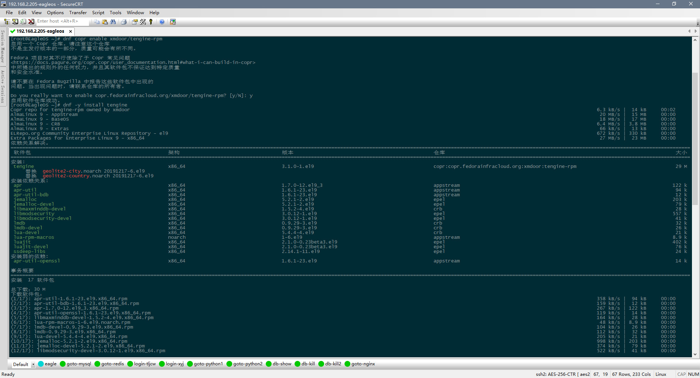

## **Tengine RPM** [English](README.md)

Tengine是亚洲最大的电子商务网站淘宝网推出的高性能的HTTP和反向代理web服务器。它基于 Nginx HTTP 服务器，拥有许多高级功能。事实证明，Tengine 在淘宝网、天猫、优酷、阿里速卖通和阿里云等世界前100强网站上非常稳定、高效。

简言之，Tengine是一个具有一些高级功能的 Nginx 发行版。Tengine官方没有提供RPM包，这里提供非官方的经过优化编译并集成LuaJIT、ModSecurity、geoip2等多种常用模块的Tengine RPM包，方便用户在目标服务器上快速安装配置web服务器。

这是基于官方包https://tengine.taobao.org/download/tengine-3.1.0.tar.gz 制作的rpm包，您可免费下载并安装使用。

目前仅先推出基于almalinux 9.5的rpm包，同样可用于Red Hat Enterprise Linux (RHEL) 及其衍生产品，如CentOS Linux、Rocky Linux。

## **如何下载？**

https://github.com/eagleos/tengine-rpm/releases

https://tengine-rpm.sourceforge.io

## **如何安装？**

- **手工安装**

rpm -Uvh tengine-3.1.0-1.el9.x86_64.rpm

如：
```shell
[root@EagleOS ~]# rpm -ivh tengine-3.1.0-1.el9.x86_64.rpm
错误：依赖检测失败：
geolite2-city < 20250331 被 tengine-3.1.0-1.el9.x86_64 取代
geolite2-country < 20250331 被 tengine-3.1.0-1.el9.x86_64 取代
[root@EagleOS ~]# rpm -Uvh tengine-3.1.0-1.el9.x86_64.rpm
Verifying...                          ################################# [100%]
准备中...                          ################################# [100%]
正在升级/安装...
1:tengine-3.1.0-1.el9              ################################# [ 33%]
正在清理/删除...
2:geolite2-country-20191217-6.el9  ################################# [ 67%]
3:geolite2-city-20191217-6.el9     ################################# [100%]
```

如下图所示：


- **在线安装**

```shell
dnf copr enable xmdoor/tengine-rpm
dnf -y install tengine
```
如下图所示：



## **配置说明**

- nginx配置文件位于：/app/nginx/conf
- 安装后会自动启动nginx服务，手工重启服务命令：systemctl restart nginx，重载配置命令：systemctl reload nginx
- 安装rpm包过程中，会自动检测目标服务器cpu核数，对nginx配置进行自动优化配置处理
- 对于目标服务器默认站点，在nginx.conf中对境外服务器默认禁止访问，以节省服务器相关访问资源。您如果需要开放此访问，可更改此文件，删除如下配置语句即可：
```shell
  if ($ip_deny) {
  return 503;
  }
```
- 支持lua语法，相关测试语句请查看nginx.conf中配置，可修改相关配置进行测试
- vhost.conf为站点配置示例，默认未加载，可仿之修改并启动
- 本rpm包编译参数如下：
```shell
[root@EagleOS ~]# nginx -V
Tengine version: Microsoft-IIS/3.1.0
nginx version: Microsoft-IIS/8.5/1.24.0
built by gcc 11.5.0 20240719 (Red Hat 11.5.0-5) (GCC)
built with OpenSSL 3.2.2 4 Jun 2024
TLS SNI support enabled
configure arguments: --prefix=/app/nginx --sbin-path=/usr/sbin/nginx --with-http_ssl_module --with-ld-opt=-lpcre --with-http_stub_status_module --with-http_gzip_static_module --with-http_realip_module --with-ld-opt=-ljemalloc --with-jemalloc --with-stream --with-stream_ssl_module --with-stream_realip_module --with-stream_ssl_preread_module --with-debug --with-compat --with-file-aio --with-mail --with-mail_ssl_module --with-pcre --with-pcre-jit --with-threads --with-http_auth_request_module --with-http_dav_module --with-http_degradation_module --with-http_flv_module --with-http_gunzip_module --with-http_image_filter_module --with-http_mp4_module --with-http_random_index_module --with-http_secure_link_module --with-http_sub_module --with-http_v2_module --with-http_addition_module --with-luajit-inc=/usr/include/luajit-2.1 --with-luajit-lib=/usr/lib64 --without-http_upstream_keepalive_module --add-module=modules/ngx_backtrace_module --add-module=modules/ngx_debug_pool --add-module=modules/ngx_debug_timer --add-module=modules/ngx_http_concat_module --add-module=modules/ngx_http_footer_filter_module --add-module=modules/ngx_http_reqstat_module --add-module=modules/ngx_http_slice_module --add-module=modules/ngx_http_trim_filter_module --add-module=modules/ngx_http_upstream_check_module --add-module=modules/ngx_http_upstream_dynamic_module --add-module=modules/ngx_http_upstream_dyups_module --add-module=modules/ngx_http_upstream_keepalive_module --add-module=modules/ngx_http_upstream_session_sticky_module --add-module=modules/ngx_http_upstream_vnswrr_module --add-module=modules/ngx_http_user_agent_module --add-module=modules/ngx_multi_upstream_module --add-module=modules/ngx_slab_stat --add-module=../ngx_cache_purge-2.5.3 --add-module=../ngx_brotli --add-module=../nginx-module-vts-0.2.4 --add-module=../ngx_http_geoip2_module --add-module=../lua-nginx-module-0.10.28 --add-module=../ModSecurity-nginx-master --with-cc-opt='-O2 -flto=auto -ffat-lto-objects -fexceptions -g -grecord-gcc-switches -pipe -Wall -Werror=format-security -Wp,-D_FORTIFY_SOURCE=2 -Wp,-D_GLIBCXX_ASSERTIONS -specs=/usr/lib/rpm/redhat/redhat-hardened-cc1 -fstack-protector-strong -specs=/usr/lib/rpm/redhat/redhat-annobin-cc1 -m64 -march=x86-64-v2 -mtune=generic -fasynchronous-unwind-tables -fstack-clash-protection -fcf-protection' --with-ld-opt='-Wl,-z,relro -Wl,--as-needed -Wl,-z,now -specs=/usr/lib/rpm/redhat/redhat-hardened-ld -specs=/usr/lib/rpm/redhat/redhat-annobin-cc1 -Wl,-E'
```

## **FAQ**

- **1.为何使用`rpm -Uvh`而不是`rpm -ivh`？**

答：如果目标服务器已经安装了系统默认的geolite2-city和geolite2-country，则其中的IP数据库文件是2019年过旧的数据库，本rpm包中包含同样路径及名称的IP数据库文件（2025.03.31官方maxmind.com最新数据库），会覆盖安装，所以需要使用`rpm -Uvh`进行升级安装。
